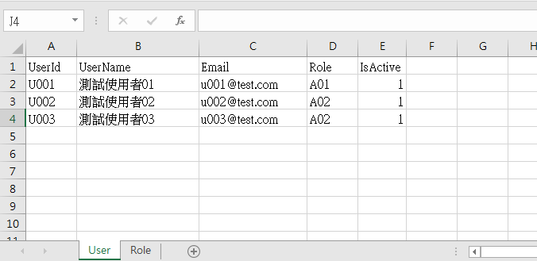
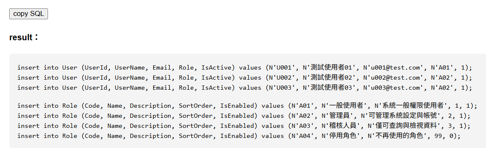

# Excel-to-SQL
Drag and drop to convert Excel to SQL insert statements.  
All files are processed locally in your browser, without uploading to any server.  
You can try it yourself [here](https://curtischou-51.github.io/Excel-to-SQL/src/).

## 功能介紹
Excel-to-SQL 是一個前端工具，將 Excel 檔案中的資料轉換為 SQL insert statements。是先前 toolkit [Google Apps Script Sheet2sql](https://github.com/CurtisChou-51/dev-toolkit-and-notes/tree/main/toolkits/Google%20Apps%20Script%20Sheet2sql) 的 JavaScript 版本，發佈到 GitHub Pages 更方便使用。

### 1. Select Excel File

### 2. View and Copy SQL Statements

## 使用套件
- [SheetJS](https://sheetjs.com/)：用於解析 Excel 檔案

所有套件皆以 CDN 方式於前端載入，無需額外安裝。
